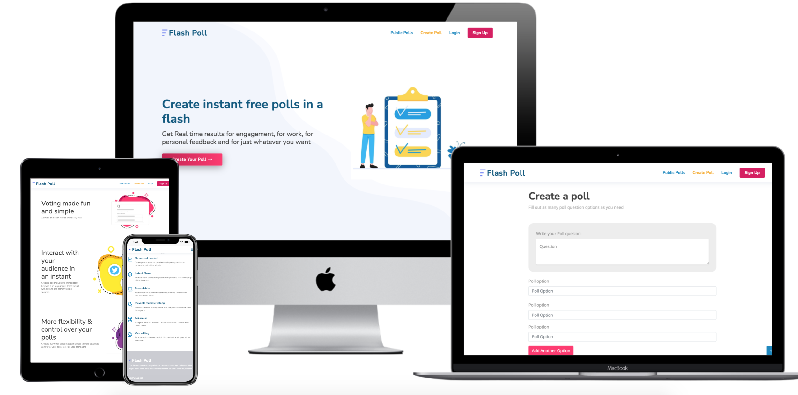

<h1 align="center">FlasPoll.io</h1>

[View the live project here.](http://flashpoll.io)

FlashPoll.io is a free online app to create polls quickly with easy to read results. Poll familys, friends, work colleague or even for an event. FlashPoll.io has exactly the features you need to create poll in a flash.

### Features
* No regestration required to create a poll
* Many easy share options including a QR Code
* Set a end date or leave the poll open
* Session logging to prevent multiple voting
* Poll can be made public for others and search engines to find
* Create an account for more control over your polls
* API to allow intergration into other apps such as Powerpoint
* If you create an account you can edit poll after creation as long as not votes have occured yet
* You can delete a poll if you create a poll with your account


### Features to implement
* Add forgot passowrd using Flask Mail and UUID to create a time limited token
* On the results page the results are only update on page refresh. Ajax could be added to check every 30 secs and dynamiclay update the results
* Add requests per miniute limmit on the api to prevent spamming
* Implement websockets for the API
* Allow changing of password and editing of details in the profile section
* Add a limit to the pagination on the public polls page. A present it is effectivily set in infinite
*  General UX importments with more interactive elements

## User Experience (UX)

### User stories

#### First Time Visitor Goals
- As a first time visitor I want to quickly understand what the webite is
- As a first time visitor I want to be able see the main features
- As a first time visitor I want to be able to quickly create a poll

#### Returning Visitor Goals
- As a returning visitor I want to be able to have no barriers to creating as polls as I want

#### Frequent User Goals
- As a Frequent User, I want to able track my polls

### Wireframes

<h2 align="center"></h2>

## Design
The app was designed be clean and the main goal of creating a poll standout.

## Technologies Used

### Languages Used

- [HTML5](https://en.wikipedia.org/wiki/HTML5)
- [CSS3](https://en.wikipedia.org/wiki/Cascading_Style_Sheets)
- [Javascript](https://en.wikipedia.org/wiki/Cascading_Style_Sheets)
- [Python](https://www.python.org/)

### Frameworks, Libraries & Programs Used

1. [Google Fonts:](https://fonts.google.com/)
    - Google fonts were used to import the 'Asap' and 'Roboto' font into the style.css file which is used on all pages throughout the project.
1. [jQuery:](https://jquery.com/)
    - jQuery came with Bootstrap to make the navbar responsive but was also used for the smooth scroll function in JavaScript.
1. [Git](https://git-scm.com/)
    - Git was used for version control by utilizing the Gitpod terminal to commit to Git and Push to GitHub.
1. [GitHub:](https://github.com/)
    - GitHub is used to store the projects code after being pushed from Git.
1. [Photoshop:](https://www.adobe.com/ie/products/photoshop.html)
    - Photoshop was used to create the logo, resizing images and editing photos for the website.
1. [Pyhton Flask:](https://flask.palletsprojects.com/en/2.0.x/)
    - Python Flask was used as the Framework
1. [PyTest:](https://docs.pytest.org/en/6.2.x/)
    - Used for testing routes
1. [MongoDB:](https://cloud.mongodb.com/)
    - MongoDB was used as the database and Pymongo was used as the Python interface
1. [Bootstrap:](https://getbootstrap.com/)
    - Bootstrap was used and the html foundation
1. [FlexStart:](https://bootstrapmade.com/demo/FlexStart/)
    - FlexStart by Bootstrapmade was used as the template design

## Testing

The W3C Markup Validator and W3C CSS Validator Services were used to validate every page of the front end to ensure there were no syntax errors in the project. However testing will need to be done on the user login sections.

-   [W3C Markup Validator](https://validator.w3.org/) - [Results](https://github.com/)
-   [W3C CSS Validator](https://jigsaw.w3.org/css-validator/#validate_by_input) - [Results](https://github.com/)

The website has been tested on multiple device to ensure it is fully responsive.

Lighthouse in Chrome DevTools was used to test performance and accesibility.

Pytest was used to test public routes. Much more testing can be done in the future to test the user pages.


### Testing User Stories from User Experience (UX) Section

First Time Visitor

- As a first time visitor I want to quickly understand what the webite is
    - Clear hero section
- As a first time visitor I want to be able see the main features
    - Main features laid out on the homepage in indvidual sections
- As a first time visitor I want to be able to quickly create a poll
    - Highlighted Create Poll option in the menu
    - Call to action button in the hero section

#### Returning Visitor Goals

- As a returning visitor I want to be able to have no barriers to creating as many polls as I want
    - The hero section clearly mentions that it is free to create a poll quickly with a call to action

#### Frequent User Goals

- As a Frequent User, I want to able track my polls
    - The user has the ability to create a free account to create, read, update and delete their polls

### Further Testing

- The Website was tested on all major browsers Google Chrome, Internet Explorer, Microsoft Edge and Safari.
- The website was viewed on a variety of devices such as Desktop, Laptop, iPhone7, iPhone 8 & iPhoneX.
- All links were fully tested using the tool https://www.deadlinkchecker.com/website-dead-link-checker.asp
- Friends and family members were asked to review the site and documentation to point out any bugs and/or user experience issues. 
- An issue and bug tracking form was created to capture and organise issues https://docs.google.com/forms/d/e/1FAIpQLSdNLVMxg7r8N_QqMUZTauve1_v-7IZILd-jC0k2aPuGr4pqyQ/viewform?usp=sf_link

### Known Bugs

- No know bugs have been reported

## Database schema

FlashPoll.io uses two collections, Users and Polls

Users Schema:
```js
{
  "_id": ObjectId(),
  "firstName": string,
  "lastName": string,
  "email": string,
  "username": string,
  "password": string
}
```

Polls Schema:
```js
{
  "_id": ObjectId(),
  "question": string,
  "total_votes": int,
  "pollQuestions": {},               // will have many, see pollQuestions schema
  "public": bool,
  "user_id": string,
  "created": timestamp,
  "username": string,
  "endDate": timestamp
}

```

pollQuestions Schema:
```js

key: {
  "option": string,
  "votes": int
}

```

## Deployment

### GitHub Pages

The project was deployed to GitHub Pages using the following steps...

1. Log in to GitHub and locate the [GitHub Repository](https://github.com/)
2. At the top of the Repository (not top of page), locate the "Settings" Button on the menu.
    - Alternatively Click [Here](https://raw.githubusercontent.com/) for a GIF demonstrating the process starting from Step 2.
3. Scroll down the Settings page until you locate the "GitHub Pages" Section.
4. Under "Source", click the dropdown called "None" and select "Master Branch".
5. The page will automatically refresh.
6. Scroll back down through the page to locate the now published site [link](https://github.com) in the "GitHub Pages" section.

### Forking the GitHub Repository

By forking the GitHub Repository we make a copy of the original repository on our GitHub account to view and/or make changes without affecting the original repository by using the following steps...

1. Log in to GitHub and locate the [GitHub Repository](https://github.com/)
2. At the top of the Repository (not top of page) just above the "Settings" Button on the menu, locate the "Fork" Button.
3. You should now have a copy of the original repository in your GitHub account.

### Making a Local Clone

1. Log in to GitHub and locate the [GitHub Repository](https://github.com/)
2. Under the repository name, click "Clone or download".
3. To clone the repository using HTTPS, under "Clone with HTTPS", copy the link.
4. Open Git Bash
5. Change the current working directory to the location where you want the cloned directory to be made.
6. Type `git clone`, and then paste the URL you copied in Step 3.

```
$ git clone https://github.com/ukkpower/Backend-Development-Milestone-Project
```

7. Press Enter. Your local clone will be created.

```
$ git clone https://github.com/ukkpower/Backend-Development-Milestone-Project
> Cloning into `CI-Clone`...
> remote: Counting objects: 10, done.
> remote: Compressing objects: 100% (8/8), done.
> remove: Total 10 (delta 1), reused 10 (delta 1)
> Unpacking objects: 100% (10/10), done.
```

Click [Here](https://help.github.com/en/github/creating-cloning-and-archiving-repositories/cloning-a-repository#cloning-a-repository-to-github-desktop) to retrieve pictures for some of the buttons and more detailed explanations of the above process.

## Credits

### Images

- [Vecteezy](https://www.vecteezy.com/) was used for all homepage images.

### Code

- [QRCode.js](https://github.com/davidshimjs/qrcodejs) was used for generating QR codes form the poll url.

- [W3C Copy to clipboard](https://www.w3schools.com/howto/howto_js_copy_clipboard.asp): This JS was used to copy the poll url to the users clipboard for easy sharing.